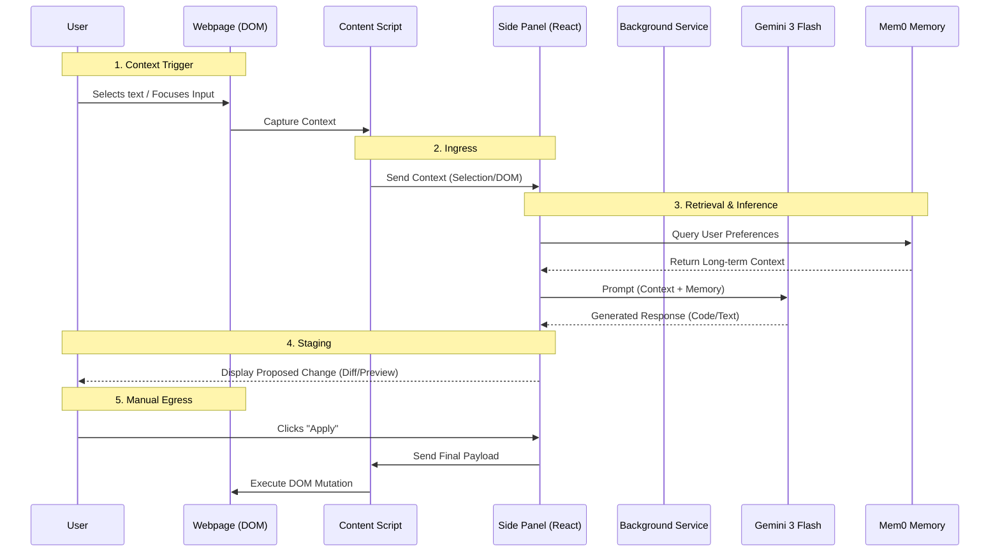

# 🏗️ Sidekick Architecture

Sidekick is designed as a **Human-in-the-Loop (HITL)** AI assistant. Unlike autonomous agents that act *for* you, Sidekick acts *with* you. It observes your context, retrieves relevant long-term memories, and **stages** potential actions for your approval.

## 🧩 Core Philosophy: The "Staging Gate"
The central architectural pattern is the **Staging Gate**. The AI **never** directly modifies the DOM or executes code without explicit user confirmation.



## 🧱 Component Breakdown

### 1. The Interface (Side Panel)
*   **Tech**: React, Tailwind CSS, Headless UI.
*   **Role**: The "Brain" and "UI". It holds the state of the current interaction.
*   **Why Side Panel?**: Unlike a popup, it stays open while you browse, allowing for persistent assistance during long tasks (like reading a PDF or debugging Kaggle code).

### 2. The Bridge (Content Scripts)
*   **Tech**: WXT Content Scripts (Isolated World).
*   **Role**:
    *   **Observer**: Listens for text selections, focus events (Kaggle cell interaction), or PDF scroll position.
    *   **Actuator**: Injects the text or code *only when commanded* by the Side Panel.

### 3. The Intelligence (Gemini 3 Flash)
*   **Tech**: Google Generative AI SDK (`utils/gemini.ts`).
*   **Role**: Reasoning engine. It receives raw text/code and returns structured improvements, explanations, or refactors.

### 4. The Memory (Mem0)
*   **Tech**: Mem0 SDK (`utils/mem0.ts`).
*   **Role**: Long-term adherence to user preferences.
    *   *Example*: If you tell Sidekick "I prefer Polars over Pandas" on a Kaggle notebook, Mem0 stores this. Next time you open a Google Doc about data science, Sidekick retrieves this preference and suggests Polars code.

## 📂 Directory Structure Strategy

```text
entrypoints/
├── background.ts       # API proxying (if needed to hide keys)
├── content.ts          # DOM access (Ingress/Egress)
└── sidepanel/          # Main UI (React App)
    ├── components/     # Reusable UI bits (ChatBubble, CodeBlock)
    ├── hooks/          # Logic (useGemini, useMemory)
    └── App.tsx         # Layout
utils/
├── gemini.ts           # AI Model config
├── mem0.ts             # Memory config
└── messaging.ts        # Type-safe messaging between CS and SP
```
